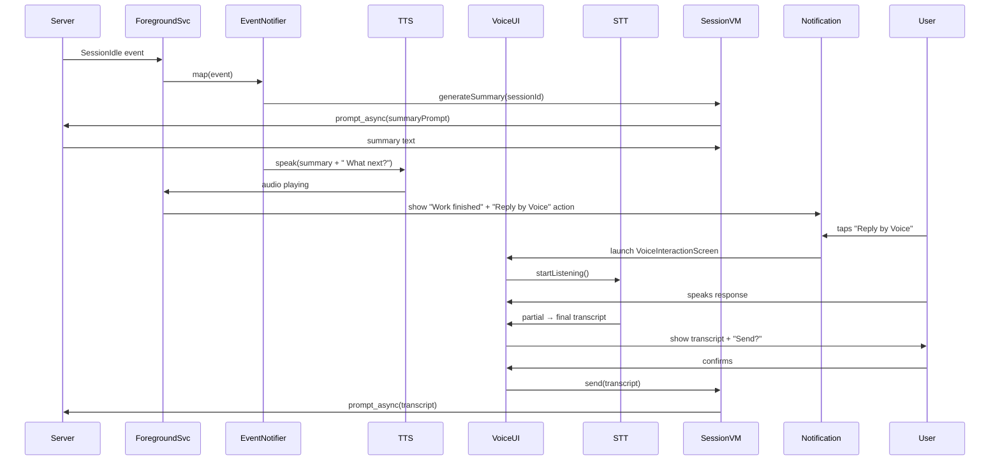

# Voice Assistant Feature Plan
## Session Completion Notification with Voice Interaction

---

## Current State (Already Implemented)
- ✅ SSE-based notification system: `RemoteForegroundService` + `EventNotifier`
- ✅ `SessionIdle` event → "Work finished" notification (channel: `jarvis_work`)
- ✅ Foreground service runs persistently, monitors `/event` stream
- ✅ Basic notification channels: work, error, permission, foreground
- ✅ Active tab in home screen shows active sessions (`showActiveOnly`)

---

## Goal: Add Voice Interaction Layer
When an active opencode session finishes its work (transitions from busy → idle), the app should:
1. **Speak** a summary of what was accomplished (TTS)
2. **Ask** the user what to do next via voice
3. **Record** the user's voice response
4. **Transcribe** (STT) → **confirm** → **send as prompt** to the session

---

## Architecture & Integration Points

### 1. Session Completion Detection
- **Already working**: `HomeViewModel` polls `/session/status` every 2s via `statusFlow`
- **Already working**: `RemoteForegroundService` receives `SessionIdle` SSE event
- **Need**: Bridge `SessionIdle` → trigger TTS summary + voice interaction

### 2. Session Summary Generation
- **Source**: Last N messages from transcript (last user prompt + assistant response)
- **LLM**: Use existing session to generate a 1-2 sentence summary via prompt:
  > "Summarize what was just completed in 1-2 sentences for a voice notification"
- **Implementation**: Call `client.sendPrompt(sessionId, summaryPrompt)` → wait for response → use as TTS text

### 3. Voice Notification (TTS)
- **Engine**: Android built-in `TextToSpeech` (free, offline) or **ElevenLabs** (premium)
- **Trigger**: Extend `EventNotifier.map()` for `SessionIdle` to include summary + TTS
- **Playback**: `TextToSpeech.speak()` immediately; also show notification with "Reply by Voice" action

### 4. Voice Interaction Flow
```
[SessionIdle event] 
    → [Generate summary via LLM prompt]
    → [TTS speaks: "<summary>. What would you like to do next?"]
    → [Show notification with "Reply by Voice" action]
    → [User taps notification OR auto-launches voice screen]
    → [STT records user response]
    → [Show transcript + "Send?" confirmation]
    → [User confirms]
    → [POST /session/{id}/prompt_async with transcript]
```

### 5. STT Implementation
| Option | Pros | Cons |
|--------|------|------|
| **Android SpeechRecognizer** (direct API) | Free, built-in, custom UI | Requires Google app, network |
| **RecognizerIntent** | Simplest | Shows system dialog |
| **Whisper (RunAnywhere/Sherpa-ONNX)** | Offline, private | ~75MB model |
| **OpenAI Whisper API** | High accuracy | Requires key, cost |

**Decision**: **Android SpeechRecognizer** (direct API) for zero-cost MVP. Interface-based for future swap.

### 6. Voice Recording & VAD
- **Recording**: `AudioRecord` (16kHz, 16-bit PCM, mono) for VAD
- **VAD**: WebRTC VAD for silence detection → auto-stop (7s silence timeout)
- **Barge-in**: Stop TTS if user starts speaking during playback

---

## Updated Implementation Plan (Sub-Agent Breakdown)

### Sub-Agent 1: TTS Engine & Voice Notification
**Files**: `tts/`, `notify/`
- `TextToSpeechEngine` interface + `AndroidTtsEngine` implementation
- `VoiceNotificationPlayer` — plays TTS immediately on `SessionIdle` with summary
- Extend `EventNotifier` to fetch summary + trigger TTS
- Voice selection, pitch/speed config
- **Test**: "Session completed: fixed the login bug. What would you like to do next?"

### Sub-Agent 2: STT Engine & Voice Recording
**Files**: `stt/`, `audio/`
- `SpeechToTextEngine` interface + `AndroidSttEngine` (direct SpeechRecognizer)
- `VoiceRecorder` with `AudioRecord` + WebRTC VAD
- `VoiceActivityDetector` — silence timeout (7s), speech threshold
- Real-time partial results for live transcript UI
- Permission handling (`RECORD_AUDIO`)

### Sub-Agent 3: Voice UI (Compose) & Confirmation Flow
**Files**: `ui/voice/`, `ui/session/`
- `VoiceInteractionScreen` — full-screen modal (or Dialog)
- States: `Listening` (waveform + live transcript), `Confirming` (final transcript + Yes/No), `Sending`, `Complete`
- `VoiceButton` with tap-to-talk + VAD hands-free mode
- Waveform visualizer
- Integration with `SessionViewModel.send()`

### Sub-Agent 4: Orchestration & Integration
**Files**: `notify/`, `MainActivity`, `HomeViewModel`
- `VoiceAssistantCoordinator` — wires TTS → STT → Confirm → Send
- Extend notification with "Reply by Voice" action (PendingIntent → VoiceActivity)
- Launch voice screen from notification action
- Handle lifecycle: foreground/background, permission flow, error recovery
- End-to-end test: session complete → voice notify → record → confirm → send

---

## Key Technical Decisions

| Decision | Rationale |
|----------|-----------|
| **Android SpeechRecognizer** (direct) for STT | Zero cost, built-in, custom UI; swap later via interface |
| **Android TTS** for TTS | Free, offline; upgrade to ElevenLabs via engine interface |
| **Foreground Service** for TTS playback | Guarantees playback even if app backgrounded |
| **WebRTC VAD** for silence detection | Battle-tested (FluxVoice), handles barge-in |
| **Compose Dialog/Screen** for confirmation | Native, accessible, matches app style |
| **Session-scoped** not global | User may have multiple sessions |

---

## Dependencies to Add

```kotlin
// build.gradle.kts (app)
dependencies {
    // Core - already present
    implementation("androidx.activity:activity-compose:1.9.0")
    implementation("androidx.lifecycle:lifecycle-viewmodel-compose:2.8.0")
    
    // Audio/Recording - WebRTC VAD
    implementation("org.webrtc:google-webrtc:1.0.32006")
    
    // Optional: On-device Whisper (RunAnywhere/Sherpa-ONNX)
    // implementation("ai.runanywhere:runanywhere-onnx:0.16.0")
    
    // Optional: ElevenLabs TTS
    // implementation("com.elevenlabs:elevenlabs-java:1.0.0")
}
```

```xml
<!-- AndroidManifest.xml -->
<uses-permission android:name="android.permission.RECORD_AUDIO" />
<uses-permission android:name="android.permission.FOREGROUND_SERVICE" />
<uses-permission android:name="android.permission.FOREGROUND_SERVICE_MEDIA_PLAYBACK" />
<uses-permission android:name="android.permission.POST_NOTIFICATIONS" /> <!-- API 33+ -->
```

---

## Voice Prompt Templates

### Summary Generation Prompt (sent to session)
```
"Summarize what was just completed in one conversational sentence for a voice notification."
```

### TTS Ask-Next Prompt (spoken to user)
```
"<summary>. What would you like me to do next?"
```

### Confirmation Prompt (shown in UI, spoken if desired)
```
"You said: '<transcript>'. Send this?"
```

---

## User Flow Diagram



---

## Acceptance Criteria

1. **Detection**: `SessionIdle` event triggers TTS within 2s
2. **TTS**: Summary spoken clearly; "What next?" audible; plays even if app backgrounded
3. **STT**: Tap notification → voice screen opens → mic records → live partials shown
4. **Confirmation**: Final transcript displayed; user taps "Send" or says "Yes"
5. **Send**: Transcript sent as `prompt_async` to same session; appears in transcript
6. **No regression**: Existing session/chat/permission/question flows unchanged
7. **Permissions**: `RECORD_AUDIO` requested on first voice use; graceful deny handling

---

## Sub-Agent Dispatch Order

1. **Sub-Agent 1**: TTS Engine & Voice Notification (builds on existing EventNotifier)
2. **Sub-Agent 2**: STT Engine & Voice Recording (independent of TTS)
3. **Sub-Agent 3**: Voice UI & Confirmation Flow (depends on TTS + STT interfaces)
4. **Sub-Agent 4**: Orchestration & Integration (wires everything together)

> Each agent: `.\gradlew.bat assembleDebug testDebugUnitTest` must pass before next starts.

---

## Reference Repositories

| Repo | Use Case |
|------|----------|
| `techrifter/FluxVoice` | Full streaming pipeline, VAD, barge-in, WebRTC VAD |
| `ahmedeltaher/Android-MVVM-Architecture-Android-Voice-AI-SDK` | Engine interfaces, Compose UI components, MVVM |
| `RunanywhereAI/kotlin-starter-example` | On-device Whisper + Piper TTS + Jetpack Compose |
| `ndenicolais/SpeechAndText` | Simple SpeechRecognizer + TTS in Compose |
| `getstream/stream-chat-android` | `SpeechToTextButton`, `ChatComposer` AI patterns |
| `spabolu/xai-hack` | Real-time streaming commentary, Grok Voice WebSocket |

---

## Ready to Start

Say **"go"** to dispatch **Sub-Agent 1: TTS Engine & Voice Notification**.